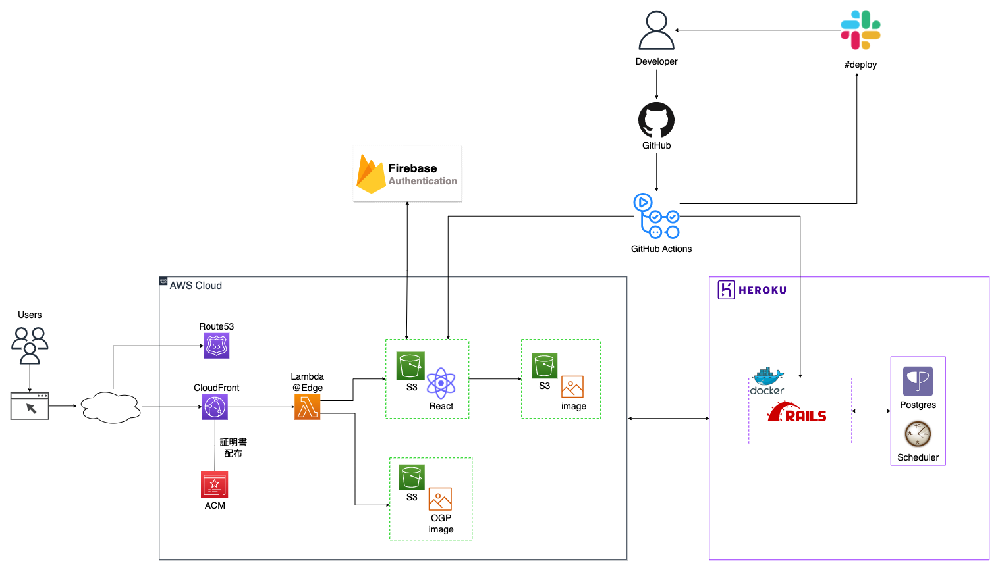

TechFinder は個人開発に役立つ技術記事を、プログラミング言語・ライブラリ・フレームワークなどのカテゴリ別に整理したデータベースサービスです。

ユーザーはお好きなカテゴリから記事を検索することができます。

▼**サービス URL**

https://techfinder.dev/

▼**紹介記事**

[【個人開発】駆け出しエンジニアのポートフォリオ作りを手助けするサービスを作りました](https://qiita.com/yusuke_blog1026/items/c68c45790a977cbd0715)

▼**告知ツイート**

https://twitter.com/yusuke_blog1026/status/1623935829377970176

---

 

## 主な機能

### コア機能（カテゴリ絞り込み・ブックマーク+α）

| カテゴリ絞り込み                                                                                                                    | ブックマーク・いいね                                                                                                                | コメント                                                                                                                                                   |
| ----------------------------------------------------------------------------------------------------------------------------------- | ----------------------------------------------------------------------------------------------------------------------------------- | ---------------------------------------------------------------------------------------------------------------------------------------------------------- |
|  |  |                         |
| カテゴリアイコンをタップすることで、そのカテゴリに紐付いた記事一覧が表示されます。                                                  | 記事右下の各種ボタンをタップすることで、ブックマークといいねができます （**ログインユーザー限定**）                                 | コメントボタンをタップすると、モーダルが立ち上がり各記事についたコメントを閲覧できたり、コメントの投稿・編集・削除ができます。（**ログインユーザー限定**） |

 

### ユーザー機能

| ログイン                                                                                                                            | マイページ上で記事を管理                                                                                                            |
| :---------------------------------------------------------------------------------------------------------------------------------- | ----------------------------------------------------------------------------------------------------------------------------------- |
|  |  |
| ログインボタンを押すと、モーダルが立ち上がり Google ログインが可能になります。                                                      | マイページ上でブックマークやいいねした記事を管理することができます。                                                                |

 

---

## 主な使用技術

### フロントエンド

- [React](https://ja.reactjs.org/)
- [TypeScript](https://www.typescriptlang.org/)
- [TailwindCSS](https://tailwindcss.com/)
- [Mantine](https://mantine.dev/)

### バックエンド

- [Ruby on Rails（API モード）](https://rubyonrails.org/)

### インフラ

- [heroku](https://jp.heroku.com/home)
- [AWS](https://aws.amazon.com/jp)
  - [Route53](https://aws.amazon.com/jp/route53/)
  - [CloudFront](https://aws.amazon.com/jp/cloudfront/)
  - [S3](https://aws.amazon.com/jp/s3/)
  - [Certificate Manager](https://aws.amazon.com/jp/certificate-manager/)
  - [Lambda@Edge](https://aws.amazon.com/jp/lambda/edge/)

### CI/CD

- [GitHub Actions](https://docs.github.com/ja/actions)

※フロント側は husky&lint-staged を用いて pre-commit 時に ESLint、Prettier を実行してコードの品質を保っています

### 環境構築

- [Docker](https://www.docker.com/)
- [docker-compose](https://docs.docker.jp/compose/toc.html)
- [Vite](https://ja.vitejs.dev/)

### 外部サービス

- [Firebase Authentication](https://firebase.google.com/docs/auth?hl=ja)
- [Qiita API](https://qiita.com/api/v2/docs)

 

## インフラ構成図

 

## ER 図・テーブル設計

 

## 画面遷移図

## コンポーネント設計
